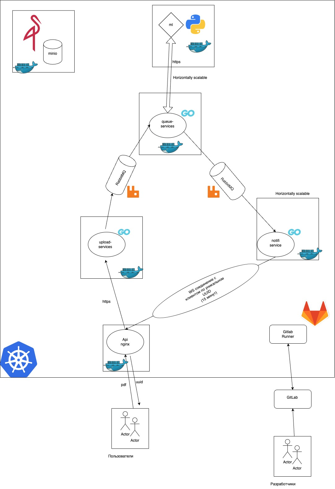
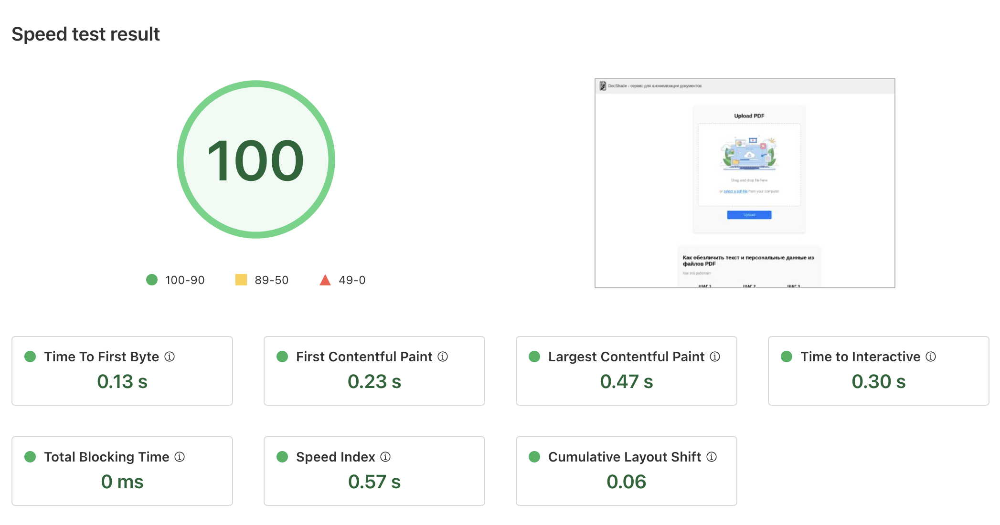

# DocShade

## Сервис для анонимизации документов

Добро пожаловать в **DocShade**

**Веб-сайт:** [docshade.kkpin.online](https://docshade.kkpin.online)

---

## 🌟 Основные особенности

### 🔒 Повышенная безопасность
- **Гибкий SSL через Cloudflare**: Обеспечение безопасной связи между пользователями и нашей платформой.
- **Шифрование документов на стороне сервера**: Обеспечение безопасного хранения промежуточных данных.
- **Не используем персональные данные**: Сервис не хранит ваши документы и какие-либо данные о вас.

### ⚡ Высокая производительность
- **Масштабируемая архитектура**: Построена на микросервисах для эффективного управления высоким трафиком и большими объемами данных.
- **Оптимизированные скорости загрузки и скачивания**: Наслаждайтесь молниеносной загрузкой и скачиванием документов.
- **CI/CD**: Удобный инструмент для поддержки и обновления кода (настроен в основном репозитории на GitLab).

### 🤖 Анонимизация на базе ИИ
- **Автоматическое скрытие данных**: Наша система автоматически удаляет личные данные из документов, обеспечивая конфиденциальность.
- **Сервис не использует сторонние API**: Система содержит проверенные временем open-source решения и не зависит от сторонних API.

---

## 🚀 Начало работы

1. **Сервис**: Перейдите на [наш сайт](https://docshade.kkpin.online).
2. **Загрузка документов**: Легко загружайте ваши документы для управления и анонимизации.
3. **Управление и анонимизация**: Используйте нашу платформу для управления документами и автоматической анонимизации.

---

## 🎉 Присоединяйтесь к будущему управления документами с DocShade!

Платформа DocShade — это ваш надежный партнер в управлении и защите ваших данных.

---

## 🖼️ Схема проекта

---

## 🖼️ Производительность

---

## Технологии и практики

### 🛠️ Технологии

- **Golang**: Используется для высокопроизводительного API Gateway и сервисов аутентификации.
- **Python**: Используется для сервисов анонимизации и обработки PDF документов, включая ML модели.
- **React**: Современный фронтенд для удобного взаимодействия с пользователями.
- **Microk8s**: Легковесный Kubernetes для развертывания и управления микросервисами.
- **Docker**: Контейнеризация для простоты развертывания и масштабирования.

### 🚀 Практики

- **Микросервисная архитектура**: Обеспечивает гибкость и масштабируемость.
- **CI/CD**: Автоматизация развертывания и обновлений через GitLab.
- **Тестирование и мониторинг**: Непрерывное тестирование и мониторинг производительности и безопасности.

---

### Установка и запуск

ToDo